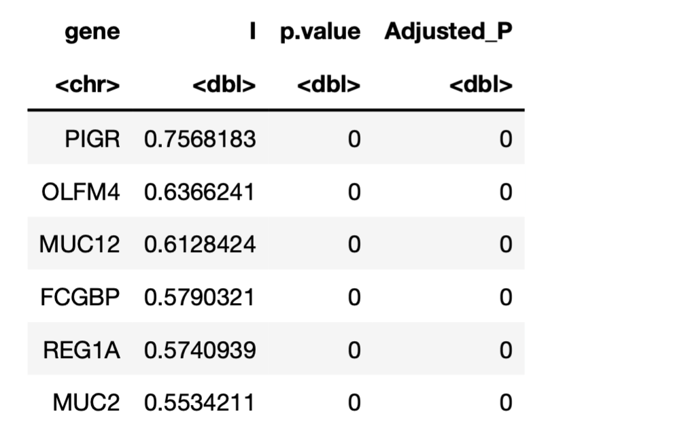
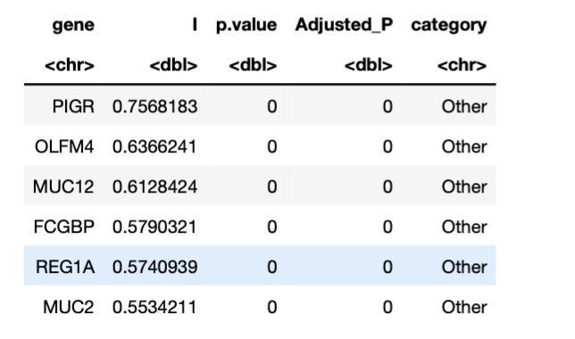
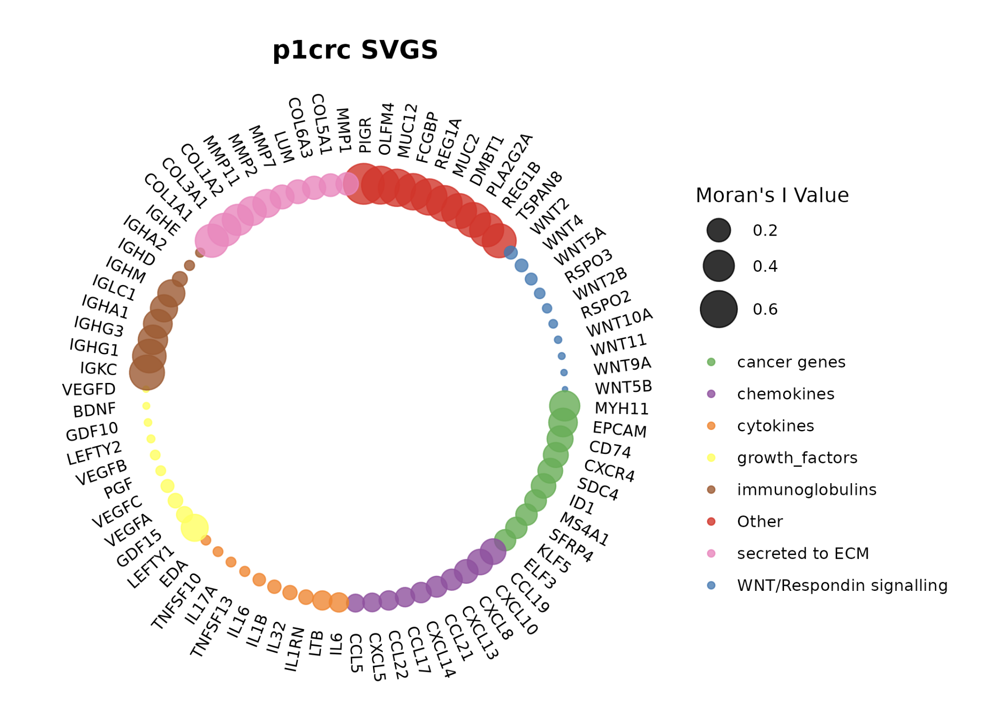
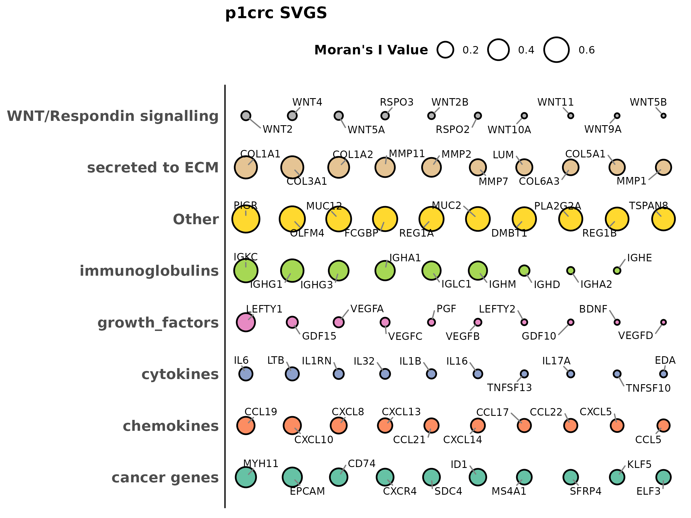
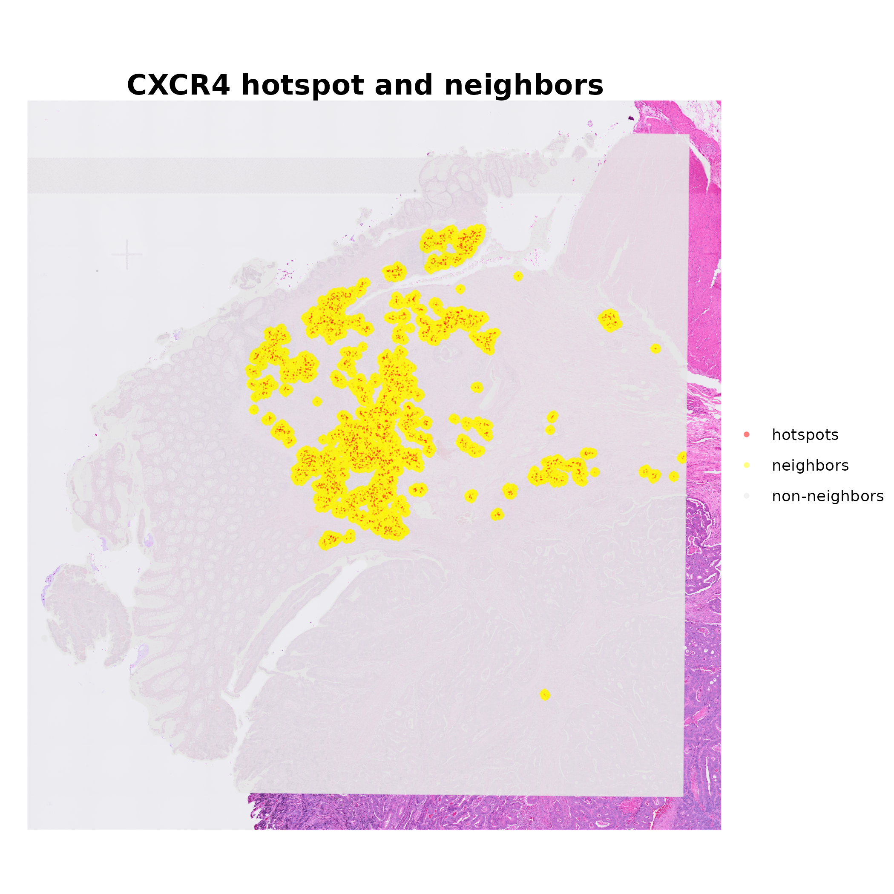
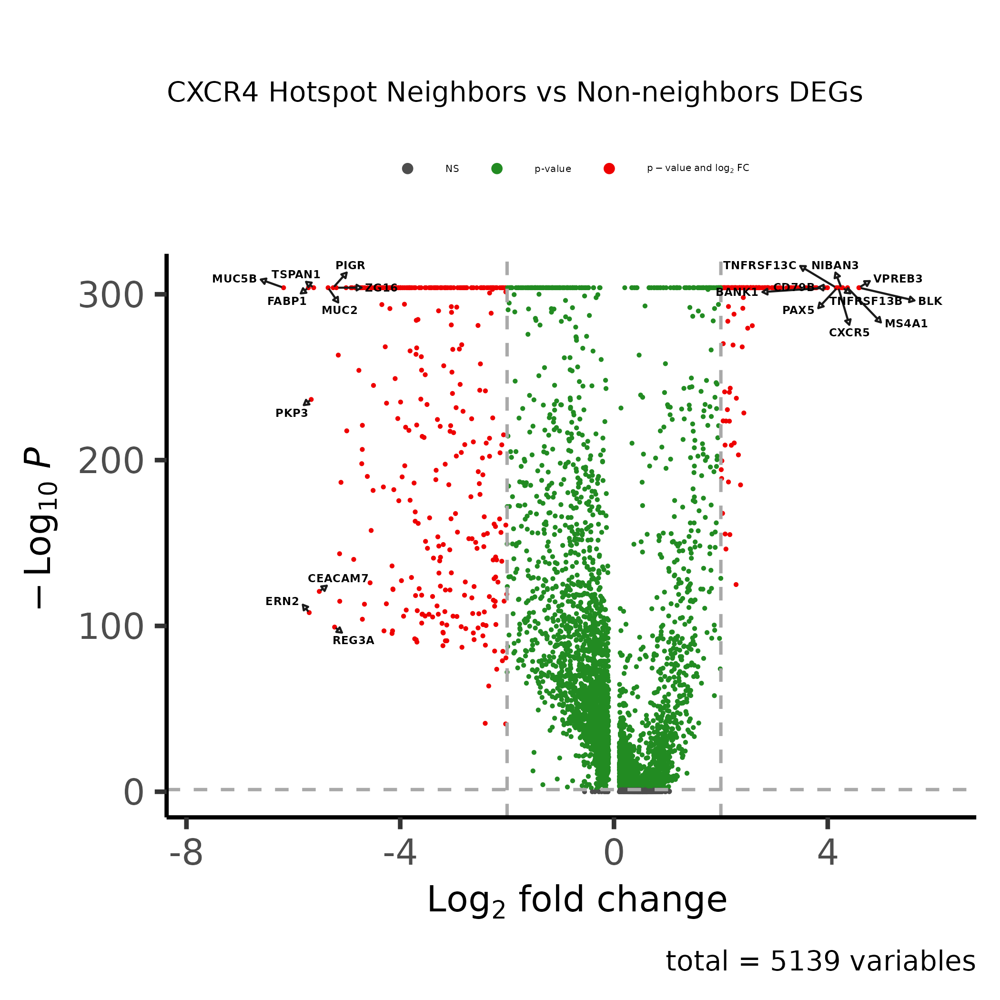

# "Segmenting Transcriptomics in Spatial Neighborhoods"

## Objectives
1. To find the spatially variable genes on the tissue based on spatial autocorrelation statistics (Moran's I)
2. To take the spatially variable genes and study their hotspots and immediate neighborhood


## Install the Package

```r
remotes::install_github("nishcomp/STING", quiet = TRUE)
```

## Package Dependencies
- Seurat
- spdep
- sf
- doParallel
- KNN
- dplyr
- ggplot2

## Basic Workflow

```r
library(ggraph)
library(igraph)
library(tidyverse)
library(RColorBrewer)
library(dplyr)
library(STING)
```

```r
seurat_obj <- Load10X_Spatial(data.dir = sample_path)
seurat_obj <- NormalizeData(seurat_obj)
```

## caclulates the spatial autocorrelation of a gene based on its neighborhood (k, number of neighbors)

**The sample studied here is P1CRC, downloaded from [10XVisium](https://www.10xgenomics.com/products/visium-hd-spatial-gene-expression/dataset-human-crc).**

```r
svgs_moran_test <- calculate_moranSVGs(sample_name = "colon10x", seurat_obj=seurat_obj, layer = "data", k = 20,
                   output_path = output_dir, min_count = 100)
                   
# outpus a csv file with Moran's I statistics, p-value, and fdr-corrected p-value for each gene present in > min_count #cells.
head(svgs_moran_test)
```


## group the genes in different categories 
*for the classification, i used protein atlas, cytokines and chemokines, immunoglobulins etc list obtained from the internet.*
Or simply label "others" or "uncategorized" to make it compatible with the plotting function




## plot the obtained genes and their statistics

#### 1. Circular Plot

```r
plot_svgs(
    df = csvgs_moran_test], 
    title = "Your Title", 
    type = "circular", 
    genes = "gene", 
    range = c(1, 10), 
    output_file = paste0("./outputdir/", "sample", "circular_SVGS.png")
  )
```



#### 2. Linear Plot

```r
plot_svgs(
    df = csvgs_moran_test], 
    title = "Your Title", 
    type = "linear", 
    genes = "gene", 
    range = c(1, 10), 
    output_file = paste0("./outputdir/", "sample", "linear_SVGS.png")
  )

```



#### 3. Find hotspots of a given gene *CXCR4 in this case*

```r
start_time <- Sys.time()
p1crc <- find_hotspots(
  seurat_object = p1crc, 
  gene_name = c("CXCR4"), 
  percentile = 0.80, # a spot should have at least  80 percentile gene exp to be a hotspot
  num_neighbors = 100,             # Check the nearest 100 neighbors
  neighbor_fraction = 0.05        # At least 5% of neighbors also should be hotspots 
)

print(Sys.time() - start_time)
```

*The `find_hotspots` function adds `hotspot_{gene_name}` as a column in the returned Seurat object.* 


You can plot the hotspot classification as a plot

```r
library(ggplot2)
p1 <- SpatialDimPlot(seuobj, pt.size.factor = 8, group.by = "hotspot_CXCR4", alpha = 0.5) + 
  theme_void() +
  scale_fill_manual(values = c("Hotspot" = "#FF0000", "Non-hotspot" = "gray95")) + 
  theme(
    legend.position = "none", 
    plot.title = element_text(hjust = 0.5, size = 16, face = "bold")
  ) +
  ggtitle("CXCR4 hotspot")
print(p1)
```


#### 4. Extend into the neighborhood of CXCR4 hotspots

```r
# conversion pixel to micron (pixels per micron)
pixel_to_micron <- p1crc@images$slice1@scale.factors$spot / 8
pixel_to_micron

# finding neighbors within 50 microns
p1crc <- STING::hotspot_neighbors(
  seurat_obj = seuobj,
  distance_threshold = 50*pixel_to_micron, metadata_column = "hotspot_CXCR4"  # 1000 microns
)
```

*The `hotspot_neighbors` function adds `hotspot_{gene_name}_neighbors` as a column in the returned Seurat object.* 

```r
p2 <- SpatialDimPlot(seuobj, pt.size.factor = 8, group.by = "hotspot_CXCR4_neighbors", alpha = 0.5) + 
  theme_void() +
  scale_fill_manual(values = c("hotspots" = "red", "neighbors" = "yellow", "non-neighbors" = "grey90")) + 
  theme(
    legend.position = "right",
    legend.title = element_blank(),
    plot.title = element_text(hjust = 0.5, size = 16, face = "bold")
  ) +
  ggtitle("CXCR4 hotspot and neighbors")
print(p2)
```



#### 5. Now that you have hotspots, neighbors, and non-neighbors classification, you can study differential gene expression or  cell-type compositions within in these tissue segments. 


